# Meeting — 2026-04-07

## Progress Report

### 프로젝트 목표

VSe3-Hf2Se9 계에서 Hf2Se9의 구조 안정성 원인을 검토하고, heterostructure의 결합 거리 및 안정화 메커니즘을 계산으로 확인한다.

핵심 질문:

1. Hf2Se9 Hf-Hf 거리가 왜 실험값보다 크게 나오는가
2. 어떤 functional/코드 조합이 실험 구조에 가장 가깝고 물리적으로 타당한가
3. Heterostructure separation energy를 어떤 구조와 방법으로 비교해야 하는가
4. CNT encapsulation이 실제 안정화 경로가 될 수 있는가

### 지난 미팅 (2026-03-19) 이후 완료한 작업

#### 1. VSe3 TP vs TAP 비교 완료 ✅

- vdW-DF2와 PBE+D2 모두에서 TP가 TAP보다 안정함을 확인하였다.
- vdW-DF2: TP가 41 meV/atom 더 안정.
- PBE+D2: TP가 20 meV/atom 더 안정.
- TP band structure는 두 방법 모두 금속성이다.

| vdW-DF2 TP | vdW-DF2 TAP |
|---|---|
| 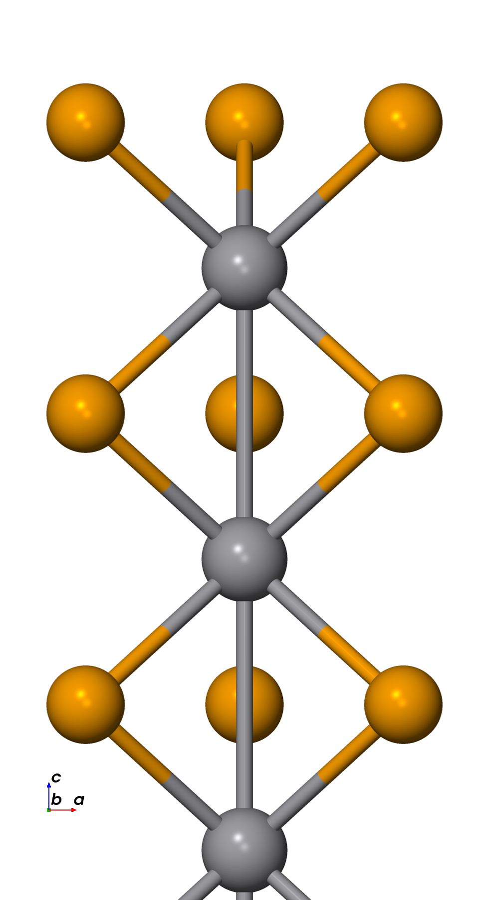 | 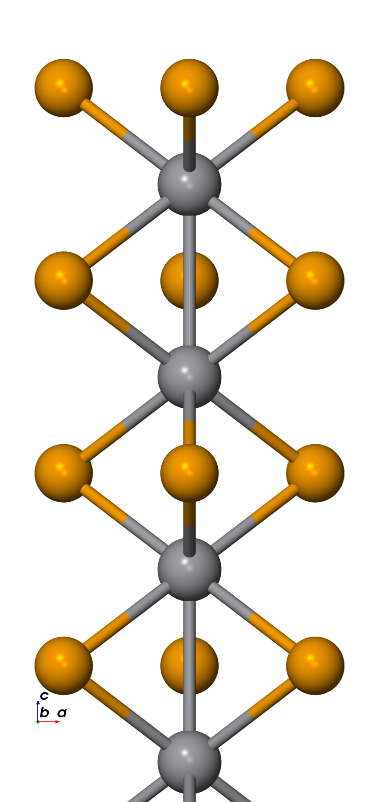 |

| vdW-DF2 TP band | PBE+D2 TP band |
|---|---|
| 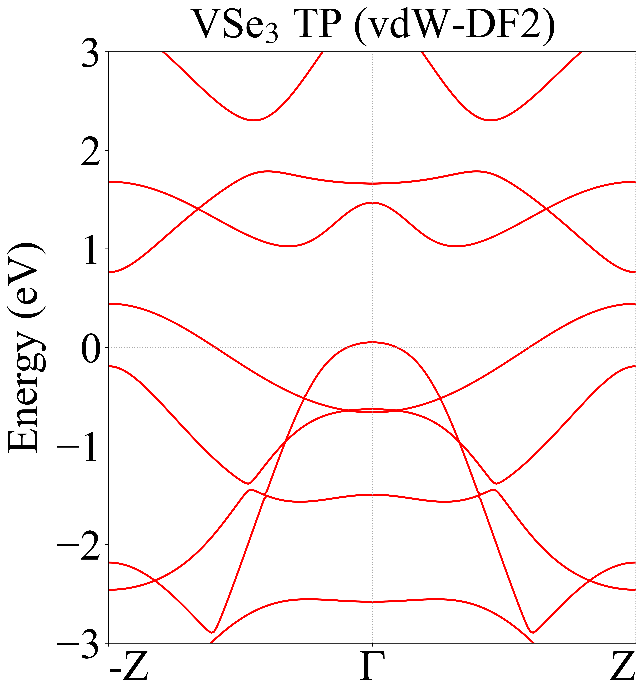 | 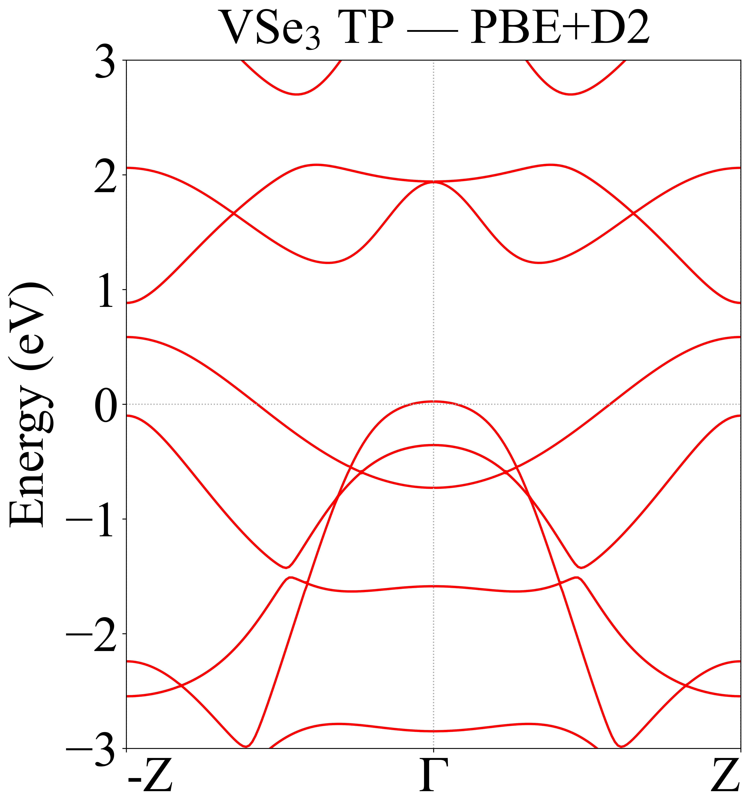 |

#### 2. Hf2Se9 molecule / chain relaxation 완료 ✅

- vdW-DF2 molecule: Hf-Hf = 3.967 A (+10%).
- vdW-DF2 chain: Hf-Hf = 4.164 A (+15.7%), vdW gap = 5.89 A (+68%).
- 두 경우 모두 실험값(3.6 A)보다 과팽창.

| molecule (vdW-DF2) | chain (vdW-DF2) |
|---|---|
| 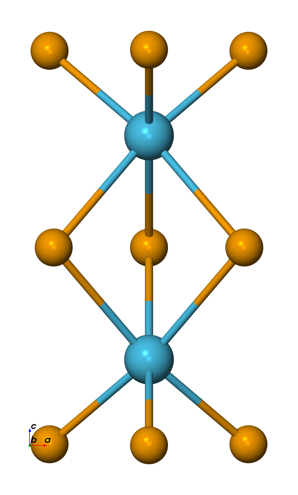 | 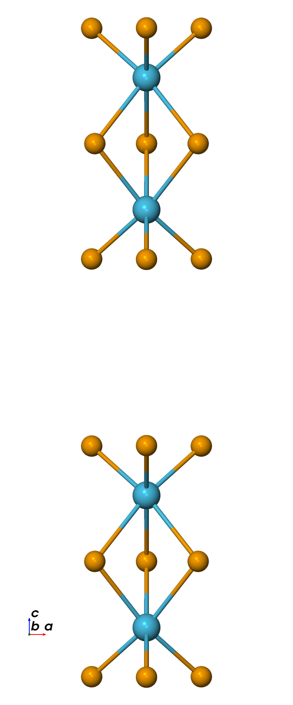 |

#### 3. Phase A functional scan ✅ / 🔄

| Test | Method | Code | Hf-Hf (A) | Δ(TEM 3.6 A) | Status |
|---|---|---|---:|---|---|
| A1 | PBE | SIESTA | 3.857 | +7% | ✅ |
| A2 | PBE+D2 | SIESTA | — | — | ❌ SCF 미수렴 |
| A2-v3 | PBE+D2 (archive) | SIESTA | — | — | 🔄 |
| A3 | vdW-DF2 | SIESTA | 3.967 | +10% | ✅ |
| A4 | PBE+D3(BJ) | SIESTA | 3.857 | +7% | ✅ |
| A5 | PBE+D3 | VASP | 2.934 | −18.5% | ✅ |
| A6 | HSE06+D3 | VASP | 3.330 | −7.5% | ✅ |
| A7 | PBE | QE | — | — | 📋 준비 |

| A1: PBE | A3: vdW-DF2 | A4: PBE+D3(BJ) |
|---|---|---|
| 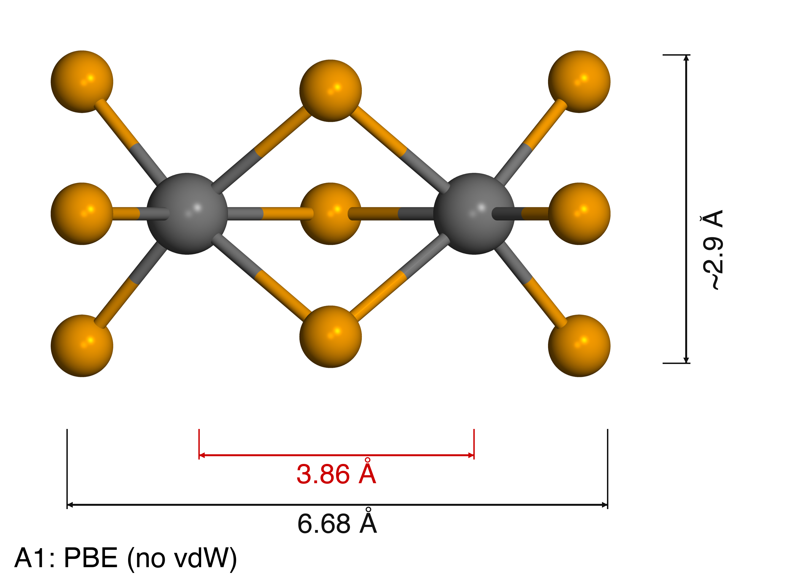 | 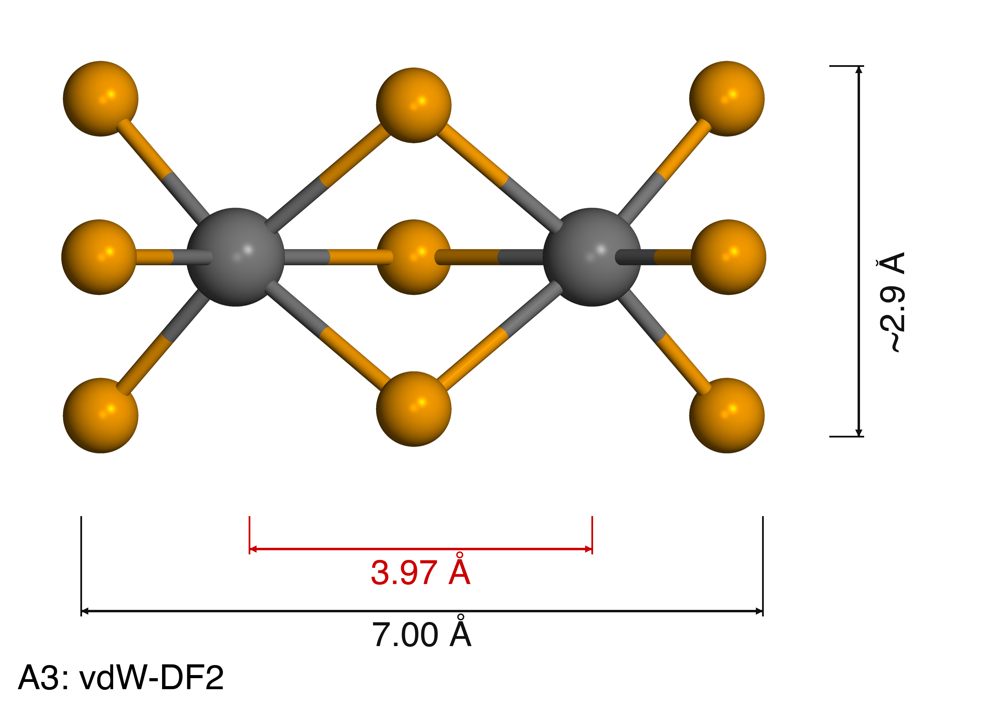 | 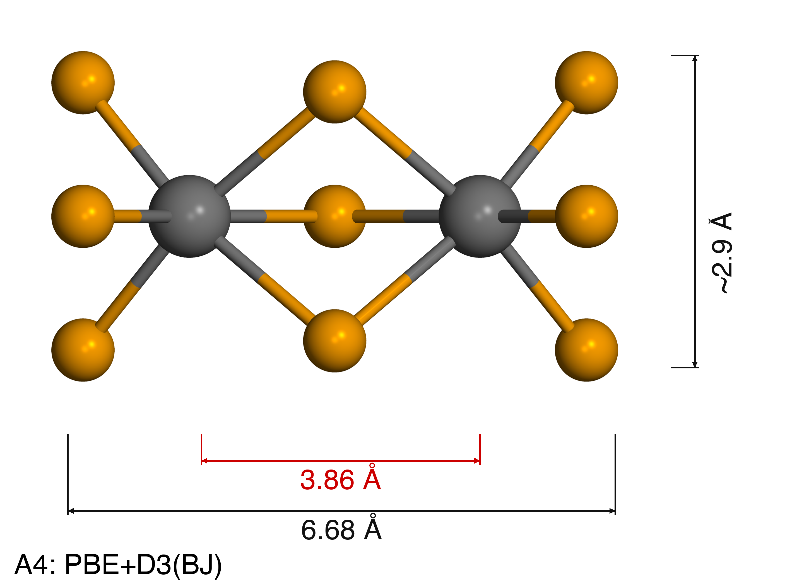 |

| A5: VASP PBE+D3 | A6: VASP HSE06+D3 |
|---|---|
| 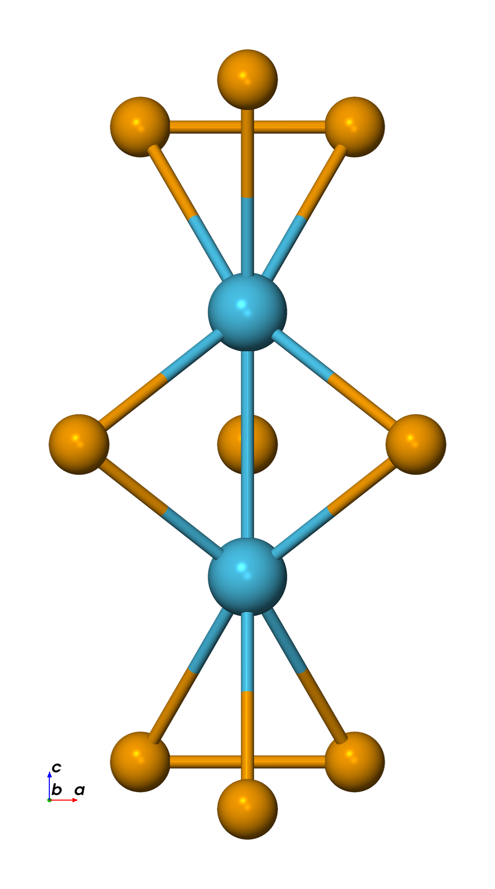 | 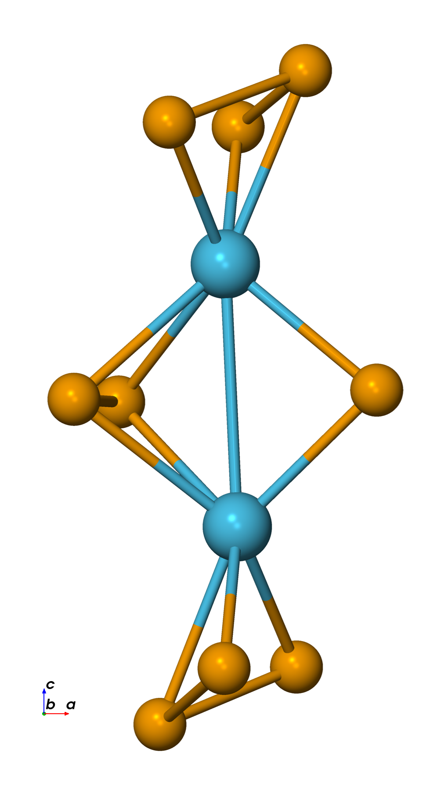 |

- SIESTA 내에서는 PBE와 PBE+D3(BJ)가 3.857 A로 실험에 가장 가깝다.
- VASP HSE06+D3는 3.330 A로 가장 근접하나, SIESTA와 VASP 간 결과 차이가 크다.
- A2(PBE+D2)는 SCF 미수렴. A2-v3(archive 설정)로 재시도 중이다.

#### 4. Heterostructure separation test — 3버전 완료 ✅

VSe3(3uc)–Hf2Se9–VSe3(3uc), separation 2.5~4.0 A.

**버전 구분:**

| Functional | VSe3 구조 | Hf2Se9 구조 | 계면 배치 |
|---|---|---|---|
| vdW-DF2 | vdW-DF2 relaxed | vdW-DF2 relaxed | V-Se3-V (비대칭) |
| vdW-DF2 | vdW-DF2 relaxed | vdW-DF2 relaxed | Se3-V-Se3 (대칭) |
| PBE+D2 | PBE+D2 relaxed | vdW-DF2 relaxed | Se3-V-Se3 (대칭) |

- vdW-DF2 비대칭 vs 대칭: 같은 functional, 같은 구조 — **계면 배치만** 다름. total energy 직접 비교 가능.
- vdW-DF2 vs PBE+D2: functional도 다르고 relaxed 구조도 다름. total energy 직접 비교 불가.

**구조 렌더링 (d = 3.5 A):**

| vdW-DF2, V-Se3-V (비대칭) | vdW-DF2, Se3-V-Se3 (대칭) | PBE+D2, Se3-V-Se3 (대칭) |
|---|---|---|
|  |  |  |

**에너지 (각 버전 내 상대 에너지, d=4.0 기준):**

| d (A) | DF2 비대칭 (eV) | DF2 대칭 (eV) | D2 대칭 (eV) |
|---|---|---|---|
| 2.5 | −3.73 | −6.21 | −8.31 |
| 3.0 | −2.00 | −4.10 | −4.89 |
| 3.5 | −0.84 | −1.61 | −1.84 |
| 4.0 | 0.00 | 0.00 | 0.00 |

- vdW-DF2 비대칭 vs 대칭 (같은 functional, 계면만 다름): Se-Se 대칭 배치가 V-facing보다 기울기가 급하다. d=4.0에서 total energy도 대칭이 0.60 eV 낮다. Se-Se 계면이 더 강하게 결합한다.
- 3개 모두 d=2.5에서 에너지가 계속 감소한다. 현재 범위(2.5~4.0 A) 내에서 minimum을 찾지 못하였다.

#### 5. Chain D2 계산 진행 🔄

- PBE+D2 chain은 197 step까지 진행 후 OOM으로 중단되었다.
- Hf-Hf = 4.47 A, max force = 0.094 eV/A. 미수렴.

| PBE+D2 chain (197 step) | vdW-DF2 chain |
|---|---|
| 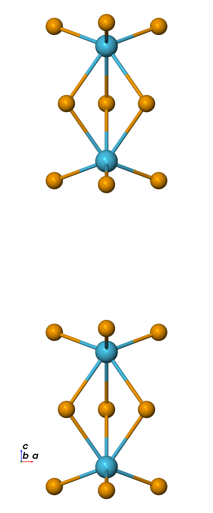 |  |

#### 6. CNT + Hf2Se9 구조 준비 완료 ✅

- CNT(9,9) + Hf2Se9 조립 구조를 생성하였다.

| side view | top view |
|---|---|
| 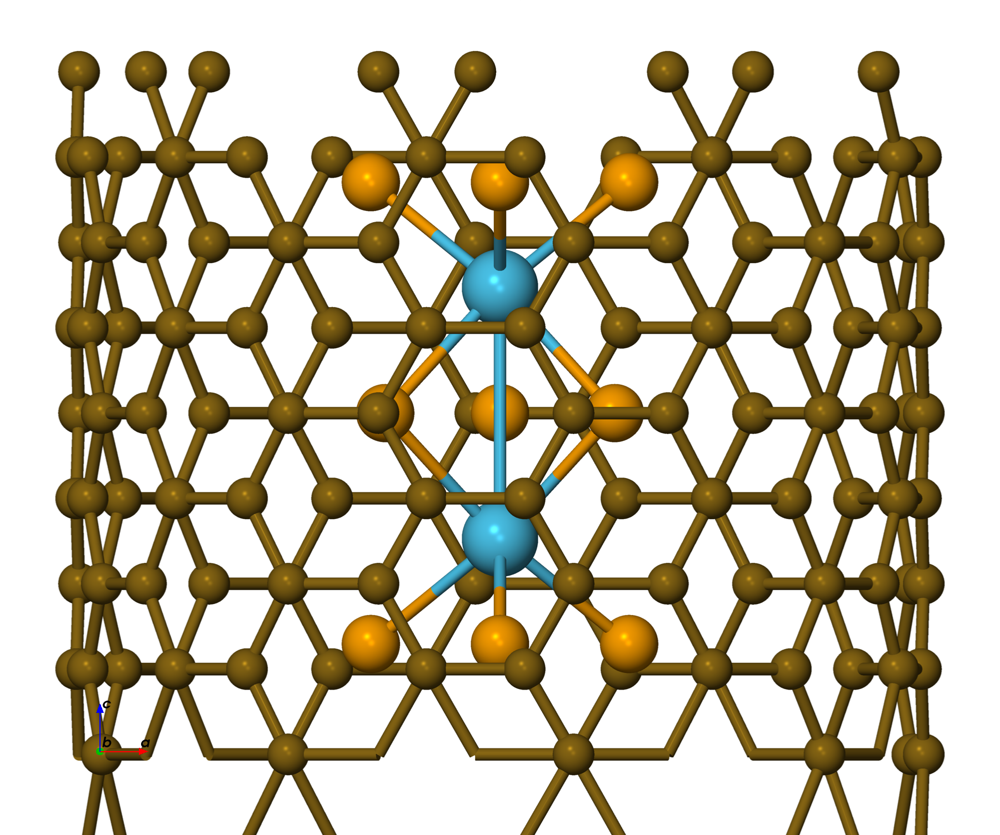 | 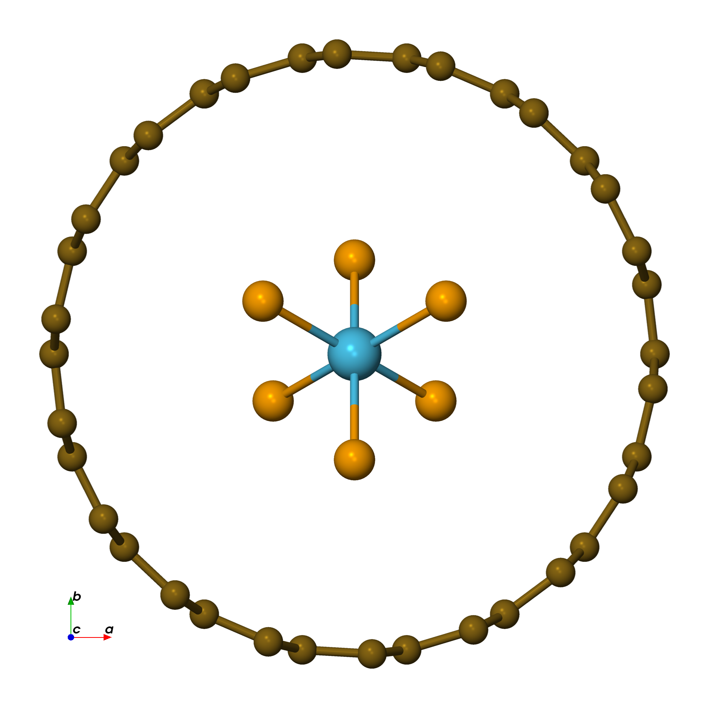 |

### 현재 진행 상태

| Work package | Status | Comment |
|---|---|---|
| VSe3 TP/TAP 비교 | ✅ 완료 | TP가 일관되게 안정 |
| Hf2Se9 mol/chain vdW-DF2 | ✅ 완료 | 과팽창 확인 |
| Phase A functional scan | 🔄 진행 중 | A2-v3, A7 남음 |
| Phase B basis scan | 🔄 진행 중 | B1 step 67 |
| Hetero separation test | ✅ 완료 | 3버전 모두 단조 감소 |
| Chain D2 | 🔄 진행 중 | OOM 재제출 필요 |
| CNT 안정화 검토 | 🔄 준비 단계 | 직경 스캔 필요 |
| Phase D (DFT+U) | 🔲 미시작 | |

### 논의사항

#### 1. Hf-Hf 과팽창 해석

SIESTA 계산에서 Hf-Hf가 실험(3.6 A) 대비 7~16% 크다. PBE와 PBE+D3(BJ)가 3.857 A로 가장 가깝지만 여전히 과팽창. VASP HSE06+D3가 3.330 A로 가장 근접하지만, 코드 간 결과 차이가 크다. 어떤 결과를 기준으로 삼을지 판단이 필요하다.

#### 2. PBE+D2 SCF 실패

A2 molecule에서 반복적으로 SCF 미수렴이 발생한다. Archive 설정(A2-v3)으로 재시도 중이나 원인이 분리되지 않았다. SCF 파라미터 문제인지, molecule 자체의 수렴성 문제인지 추가 검토가 필요하다.

#### 3. Heterostructure separation 물리적 해석

3개 버전 모두 2.5~4.0 A에서 단조 감소하여 실험(~3.5 A) 부근의 minimum이 보이지 않는다. 07 vs 08은 같은 functional(vdW-DF2)에서 계면 배치만 다른 비교가 가능하다: Se-Se 대칭 배치(08)가 V-facing(07)보다 더 강하게 결합한다. 09(PBE+D2)는 functional과 구조가 모두 다르므로 07/08과 직접 비교는 불가하다.

#### 4. CNT encapsulation 전략

CNT가 Hf2Se9를 안정화하는지 확인이 필요하다. 바로 full DFT로 가기보다 CNT 직경 single-point scan을 먼저 수행하는 편이 효율적이다.

---

## Proposed Meeting Notes

### Proposed Discussion

1. SIESTA 내에서는 PBE/PBE+D3가 실험에 가장 가깝고, VASP HSE06+D3가 전체 중 가장 가깝다. 코드 간 결과 차이의 원인을 분리하기 위해 QE A7 결과가 필요하다.
2. PBE+D2는 SCF 미수렴이 지속되고 있어 아직 결론을 내리기 어렵다.
3. Heterostructure separation test에서 3버전 모두 실험 부근의 minimum을 재현하지 못하였다. 07 vs 08(같은 vdW-DF2, 계면만 다름)에서는 Se-Se 대칭 배치가 더 강한 결합을 보인다. 09(PBE+D2)는 functional과 구조가 모두 달라 07/08과 직접 비교 불가.
4. CNT 직경 스캔은 별도 안정화 메커니즘 가설의 첫 검증 단계이다.

### Proposed Decisions

- Heterostructure separation test 결과를 현 상태로 정리하고, 추가 separation(d < 2.5 A) 또는 동일 구조 비교 여부를 결정한다.
- A2-v3와 chain D2는 보조 검증 경로로 유지한다.
- QE A7 계산을 제출하여 코드 간 비교를 진행한다.
- CNT 직경 스캔 후 relaxation과 MD 순으로 진행한다.

### Proposed Action Items

- [ ] A2-v3 결과 확인 및 정리
- [ ] Chain D2 메모리 설정 조정 후 재제출
- [ ] QE A7 제출
- [ ] Perlmutter A2-prescf 결과 확인
- [ ] CNT 직경 스캔 구조 생성 및 single-point 계산
- [ ] Phase D (DFT+U) 입력 파일 준비

## Reference Documents

- [hf2se9-stability.md](../../reports/hf2se9-stability/hf2se9-stability.md) — 마스터 계획 + 결과 테이블
- [failure-analysis.md](../../reports/initial-structures/failure-analysis.md) — Hf2Se9 relaxation 실패 원인 + hetero 3버전 비교
- [a2-scf-debug.md](../../reports/hf2se9-stability/docs/a2-scf-debug.md) — A2 SCF 실패 상세
- [vdw-methods-comparison.md](../../reports/hf2se9-stability/docs/vdw-methods-comparison.md) — vdW-DF2 vs D2 비교
- [stability-comparison-method.md](../../reports/hf2se9-stability/docs/stability-comparison-method.md) — Functional 간 비교 방법론
- [phase-c-cnt-md.md](../../reports/hf2se9-stability/docs/phase-c-cnt-md.md) — Phase C: CNT + AIMD 계획

---

## After-Meeting Notes

### Discussion

- **헤테로 separation 단조 감소 → VSe3 Se dangling bond 가설 (H termination 시도)**
  - 가설: VSe3 단면 Se에 dangling bond가 남아 있어 인터페이스에서 비물리적으로 강하게 결합. molecule(Hf₂Se₉)은 closed-shell이라 안정하므로 문제는 VSe3 측에 한정
  - 검증: VSe3 측 Se에만 H를 붙인 구조 / 안 붙인 구조를 모두 relax → 비교
  - 한계: TEM에서는 H 위치를 직접 측정할 수 없음 → 두 결과 중 어느 쪽이 실험과 더 잘 맞는지로 판단

- **CNT encapsulation 우선순위 ↓**
  - 원래 mol relax 실패 시 백업 경로였으나 mol relax가 확보됨 → 진행 중인 CNT 작업은 보류하고 헤테로 안정화에 집중

- **헤테로 relax 완료 시 → 표준 transport 계산으로 직행**
  - 헤테로 구조가 안정 relax되면 그 구조 그대로 transport 계산 routine으로 진행

### Action Items

- [ ] VSe3–Hf₂Se₉–VSe3 헤테로의 VSe3 측 Se에 H termination 추가, H 있음/없음 두 버전을 vdW-DF2로 relax → separation energy 곡선 비교 (실험 ~3.5 Å minimum 재현 여부 확인)
- [ ] 헤테로 relax 완료 시 transport 계산 (electrode + junction + I-V) 셋업
- [ ] 이양진 박사님께 VSe3 TAP relaxed 구조 파일 전달 (Supporting의 TEM image simulation 용)
