# Meeting — TBC

## Progress Report

### 지난 미팅 (2026-04-16) 합의 사항

#### Discussion

- Single-point 기준 `gap, d = 3.5 Å`가 최안정이지만 relaxation 결과로 최종 판단
- 최종 목표는 heterostructure transport I-V. Relaxation이 수렴되면 곧바로 transport로 연결
- Transport 셀 길이는 `VSe3 + 분자`와 `VSe3-only` 두 SCF의 `ΔV(z)`로 perturbation range를 측정해서 결정
- 계산 판단 시 수치보다 `물리적으로 말이 되는가`를 먼저 본다

#### Action Items

- [x] `gap, d = 3.5 Å` relaxation 수렴 확인
- [x] `VSe3 + 분자` vs `VSe3-only` SCF → `ΔV(z)` 플롯 → perturbation range 추정
- [ ] 위 range로 transport 셀 길이 결정 후 electrode/device 조립
- [ ] Relaxation 수렴 구조 실험팀 공유

### 완료한 작업

1. **`gap, d = 3.5 Å` relaxation 수렴**

<table>
<tr>
<td width="35%" align="center">
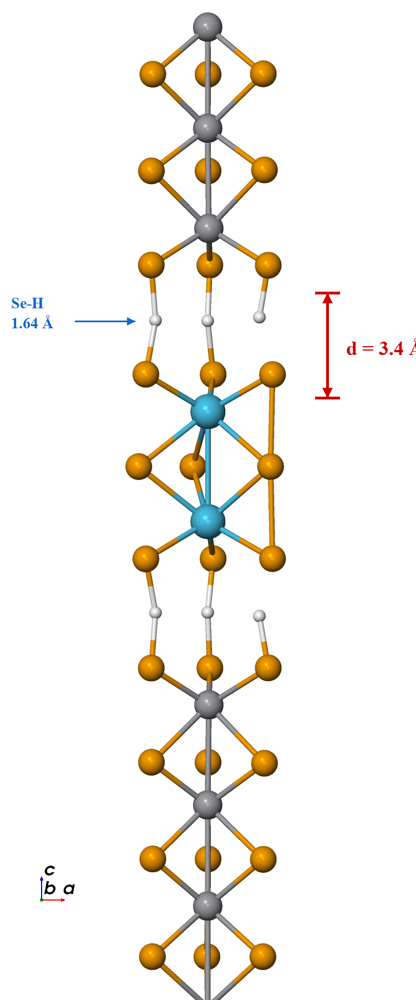 
relaxed heterostructure (a-c plane)
</td>
<td width="65%">

| 항목 | 값 |
|---|---|
| d (VSe3-Hf2Se9 terminal Se-Se 수직) | 3.4 Å (초기 3.5) |
| Se-H (own side) | 1.64 Å |
| Se-H (across gap) | 1.74 Å |
| V-V (VSe3 chain, 최근접) | 3.12 Å |
| Hf-Hf | 3.43 Å |
| cell c | 30.52 Å |
| max force | 0.0099 eV/Å |
| final EKS | -114669.07 eV |

</td>
</tr>
</table>

2. **Perturbation range 스캔 결과 (N = 8, 10, 12, 14, 20)**

구체 절차는 [`reports/perturbation-range/perturbation-range.md`](../../reports/perturbation-range/perturbation-range.md) 참고.

**정의.** A = `VSe3 + Hf2Se9 분자`, B = `VSe3-only` (A와 동일 셀·동일 VSe3 좌표·H 유지, 분자 Hf2Se9 11개만 제거). 두 시스템의 Hartree 포텐셜을 planar 평균한 뒤 ΔV를 구하고, VSe3 주기 `a = 3.135 Å` window로 macroscopic 평균한다.

$$
\bar{V}^{(A,B)}(z) \;=\; \frac{1}{A_{xy}} \iint V^{(A,B)}(x,y,z)\,dx\,dy
\qquad
\Delta\bar{V}_\mathrm{mac}(z) \;=\; \big[\bar{V}^{A} \!-\! \bar{V}^{B}\big]_\mathrm{mac}(z) \;-\; c_0
$$

여기서 `c_0`는 셀 양 끝(가장 분자에서 먼 구간, 약 `a` 폭)에서 평균한 상수 offset — A/B의 총 전자수가 달라 생기는 gauge 어긋남을 제거하기 위함. 감쇄 꼬리에 `|ΔV_mac| ∝ exp(−d/λ)`를 log-linear fit하여 screening length `λ`를 추출한다. `d = z − z_mol`, `z_mol` = Hf 두 원자 z평균.

<table>
<tr>
<td align="center">
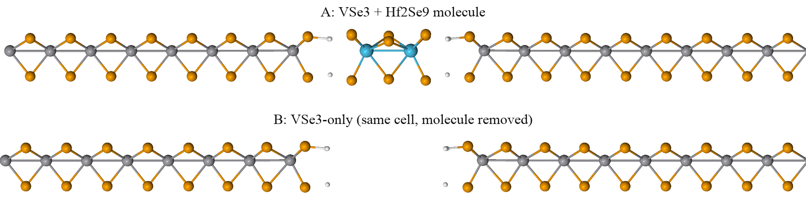 
A/B 시스템 구조 (N = 8로 표시 — N = 20은 셀 137 Å로 그리기에 과도하게 길어서 개념만 동일한 짧은 셀을 보여줌). 같은 셀·같은 VSe3 좌표를 유지하고 중앙의 Hf2Se9 분자만 제거한 것이 B.
</td>
</tr>
<tr>
<td align="center">
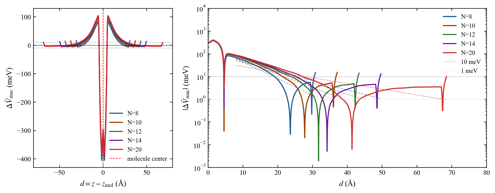 
좌: 선형 ΔVmac(d). 우: log |ΔVmac|, positive d side + 지수감쇄 fit (점선). x축은 ±80 Å로 여유 확장해 N = 20 (half = 68.5 Å) 말단 꼬리까지 보이게 함.
</td>
</tr>
</table>

| N | cell c (Å) | peak \|ΔV\| (meV) | d10meV (Å) | tail (meV)¹ | λ (Å) |
|---|---|---|---|---|---|
| 8  | 61.9  | 405 | 4.65 | 15.1 | 5.9  |
| 10 | 74.4  | 392 | 4.58 | 15.4 | 7.5  |
| 12 | 87.0  | 387 | 4.57 | 14.2 | 9.0  |
| 14 | 99.5  | 389 | 4.57 | 13.1 | 10.7 |
| 20 | 137.1 | 384 | 4.57 |  9.8 | 17.4 |

¹ `tail` = 셀 끝(d = c/2)에서 \|ΔVmac\| 값.

**관찰.**
- 분자 바로 옆은 모든 N 공통: `d ≈ 4.6 Å`에서 ΔV가 10 meV 밑으로 떨어짐. 분자 근방은 N = 8 셀로 충분.
- 셀 끝 꼬리는 N이 커질수록 작아짐: `15 → 15 → 14 → 13 → 9.8 meV` (N = 8 → 20). N = 20에서 처음 10 meV 아래로 내려옴.
- 1 meV까지 내리려면 N = 20이 필요하고, 이때 분자로부터 `d ≈ 39 Å`에서 달성.

**Transport 셀 길이.**
- 10 meV 기준: 분자 한쪽 ~5 Å만 있으면 됨 → N = 8 setup으로 충분.
- 1 meV 기준: 분자 한쪽 ~40 Å 필요 → N = 20 이상.
- 어느 기준을 쓸지는 미팅에서 확정.

3. **Heterostructure — band structure + PDOS**

| 항목 | 값 |
|---|---|
| Band gap | 3 meV (pseudo-metallic, $\ll k_B T$) |

<table>
<tr>
<td width="25%" align="center">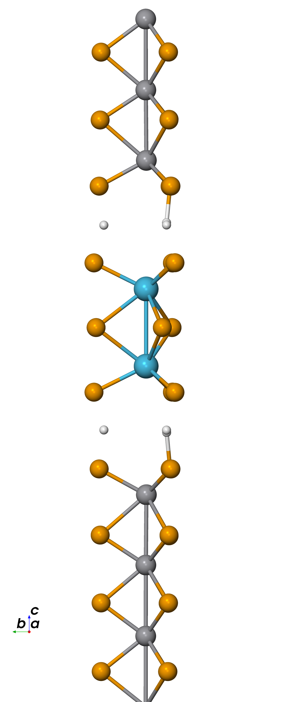</td>
<td width="75%" align="center">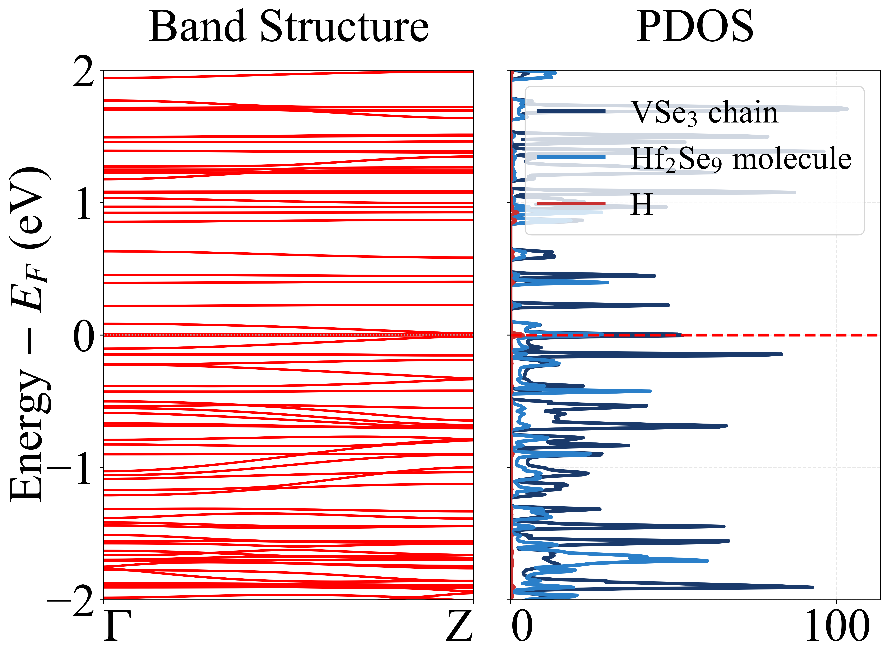</td>
</tr>
</table>

**관찰.** Eigenvalue 기준 VBM/CBM 사이 gap 은 3 meV.

4. **Transport 0 V**

<table>
<tr><td align="center">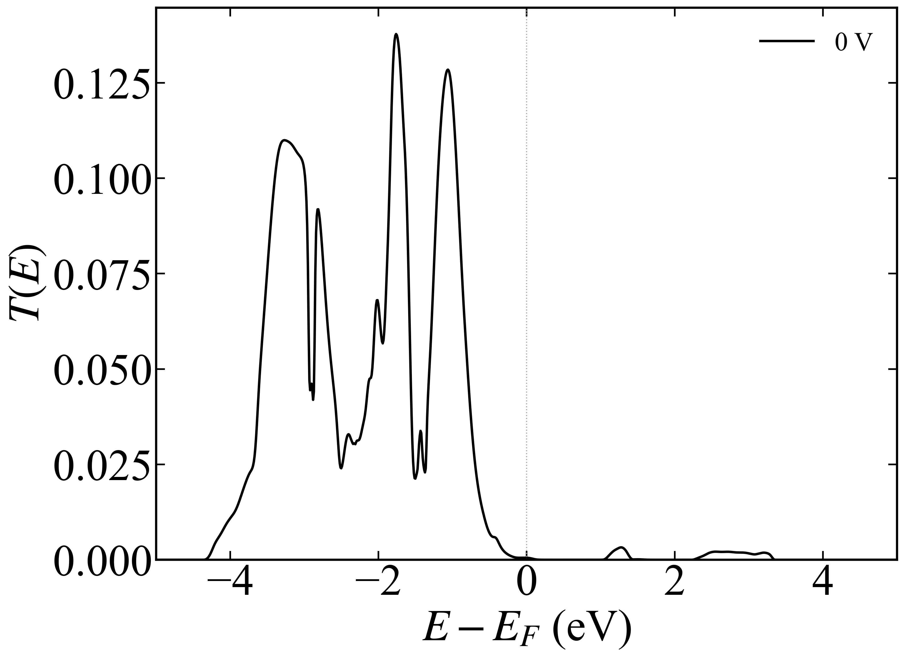 Transmission T(E)</td></tr>
<tr><td align="center">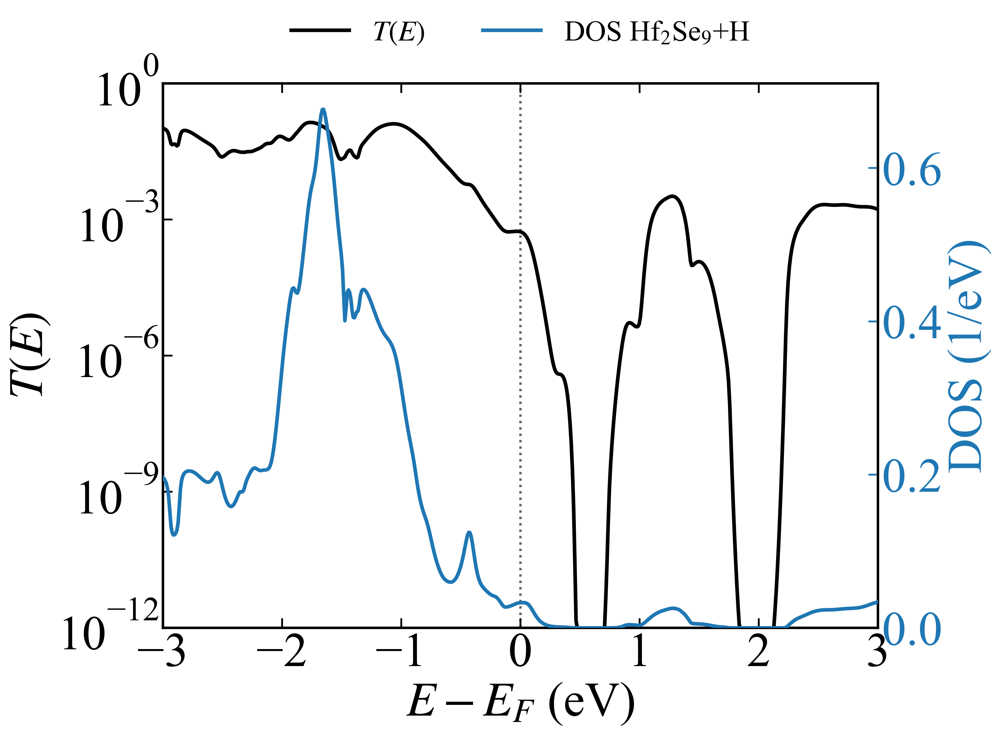 T(E) (log) + Hf2Se9+H DOS (linear) overlay. Hf2Se9 분자 + H 종단 17 atoms ADOS 합산. T(EF)=5.4×10−4, DOS(EF)=0.03 /eV.</td></tr>
</table>

---

## 헤테로 구조 수정 (2026-05-06)

위 1~4 transport 결과 헤테로에 **잘못된 분자 좌표** (Hf-Hf z = 4.16 Å) 가 들어가 있었음. 분자 자체 relax 결과(Hf-Hf z = 3.967 Å)는 정상.

정상 분자로 헤테로 d-scan 재진행 — `vdW-DF2 single-point`, `44 atoms (H termination)`, `Se-H = 1.46 Å`. `d`는 VSe3 terminal Se ↔ Hf2Se9 terminal Se 사이 z 거리.

### H termination 3 mode (d = 3.5 Å 기준 구조)

<table>
<tr>
<th></th>
<th>bond (H→V center)</th>
<th>gap (H⊥Se3)</th>
<th>tilt (H→outward)</th>
</tr>
<tr>
<td>side (a-c)</td>
<td>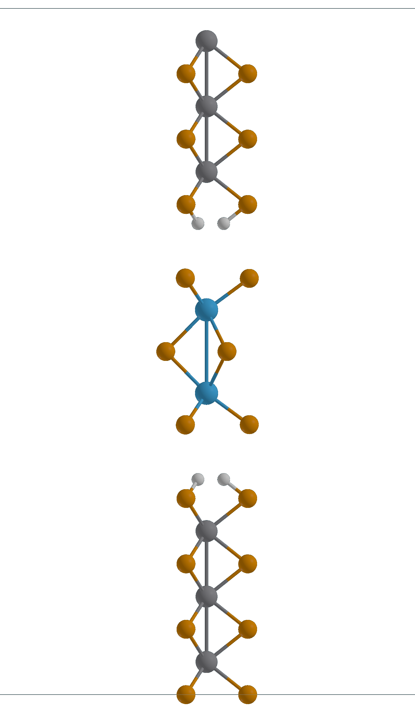</td>
<td>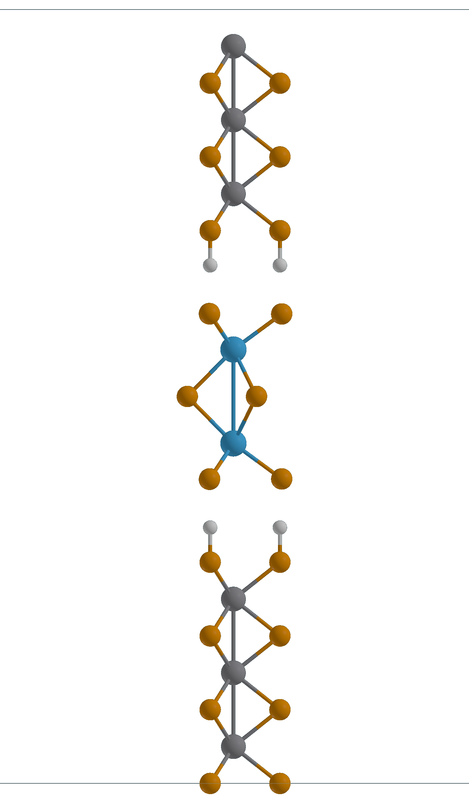</td>
<td>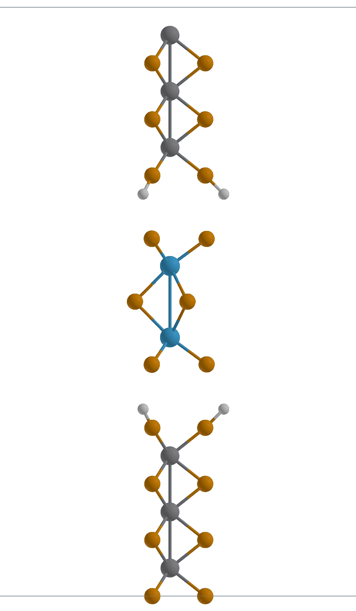</td>
</tr>
<tr>
<td>side 90° (b-c)</td>
<td>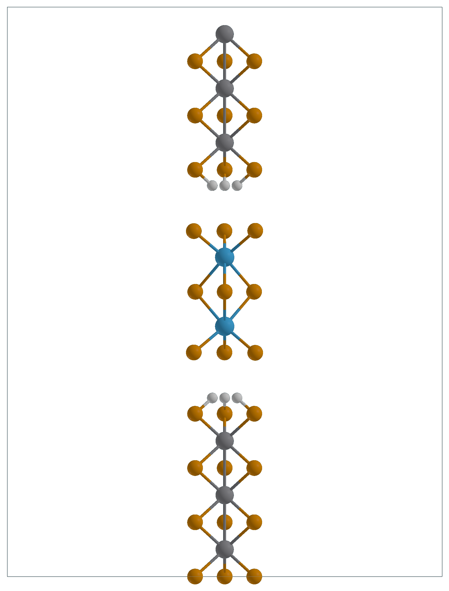</td>
<td>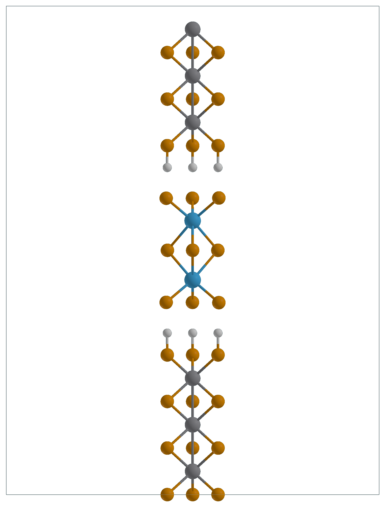</td>
<td>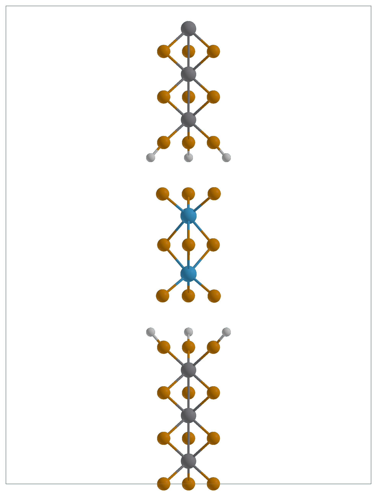</td>
</tr>
<tr>
<td colspan="4" align="center">
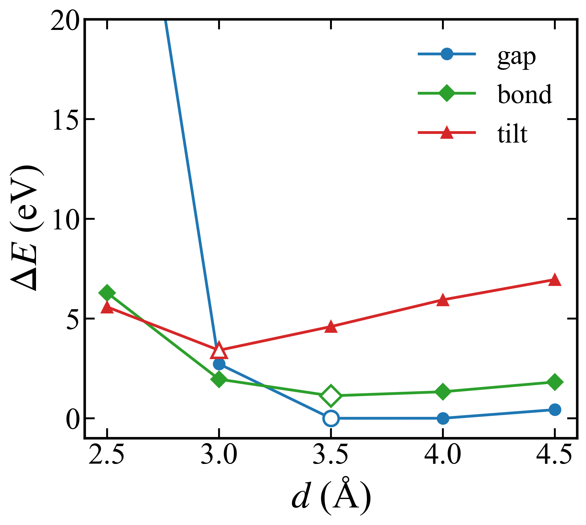 
H orientation scan: 3 mode × d sweep, total energy vs d
</td>
</tr>
</table>

**핵심 결론** (04-16 결과 재현, 분자 좌표 수정 후에도 경향 유지)

- `gap` 모드가 가장 안정. minimum은 `d = 3.5 Å` (`d = 4.0 Å`과 +1 meV 차이로 거의 동일).
- `bond`는 `gap`보다 `+1.13 eV` (04-16: +1.11 eV).
- `tilt`는 `gap`보다 `+3.41 eV` (04-16: +3.72 eV).

| mode | min d (Å) | Emin (eV) | ΔE vs gap min (eV) |
|---|---|---|---|
| gap  | 3.5 | -114681.20 | 0.00 |
| bond | 3.5 | -114680.07 | +1.13 |
| tilt | 3.0 | -114677.79 | +3.41 |

### Sandwich (H 없음, 38 atoms)

<table>
<tr>
<th>side (a-c)</th>
<th>side 90° (b-c)</th>
</tr>
<tr>
<td align="center">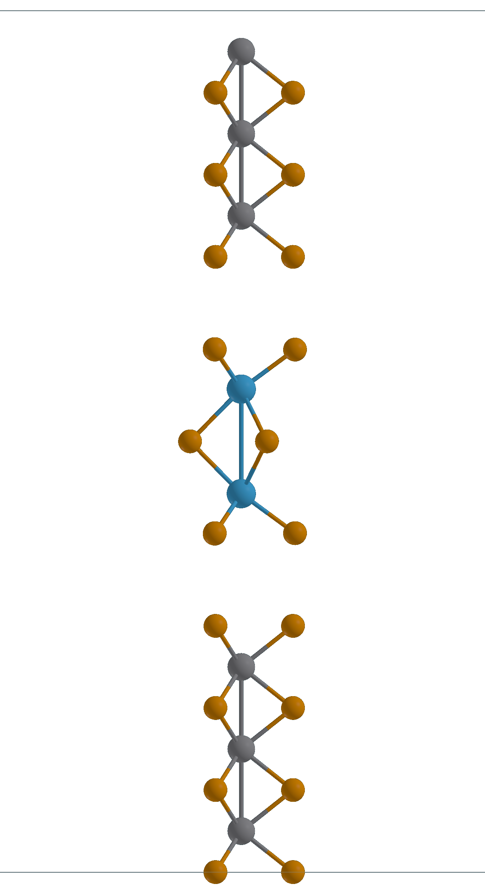</td>
<td align="center">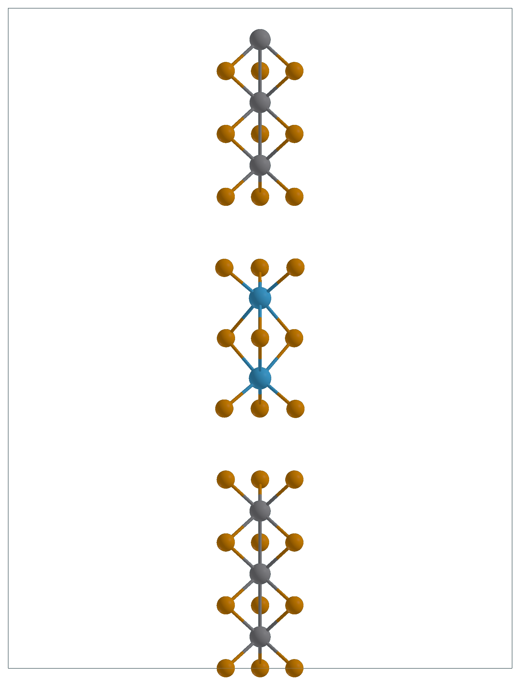</td>
</tr>
<tr>
<td colspan="2" align="center">
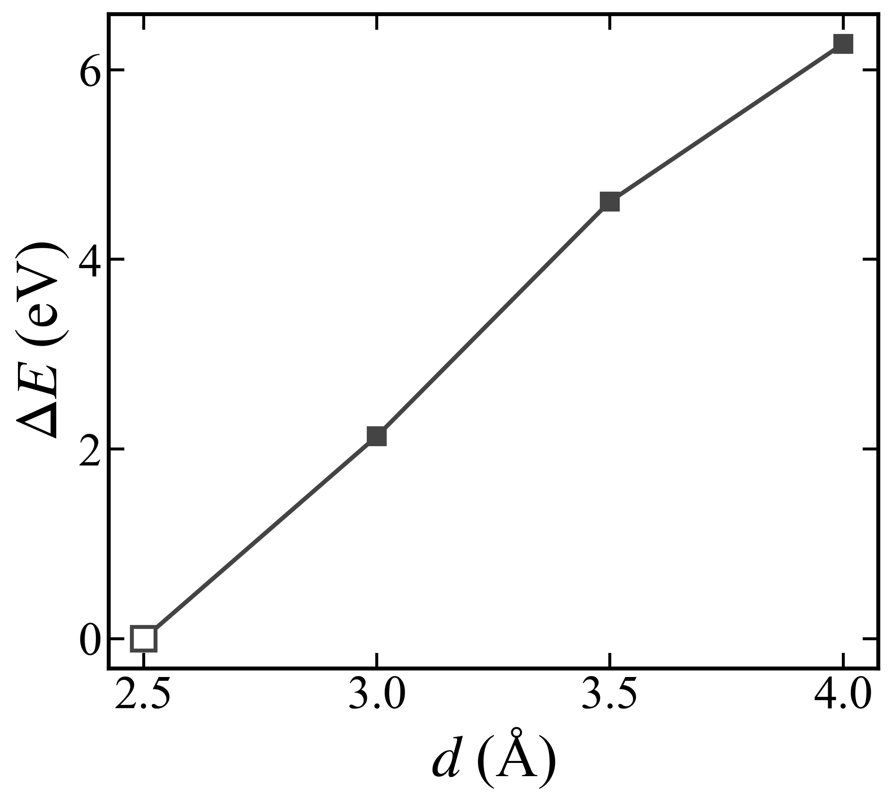 
Sandwich (H 없음): total energy vs d, equilibrium 부재
</td>
</tr>
</table>

- d = 2.5 Å에서 단조 감소, equilibrium 안 보임 — 04-16 `sep_energy_h_term.png`에서 H 없는 곡선과 동일 패턴.
- VSe3 terminal Se dangling bond에 의한 비물리적 강결합. H passivation으로 회복됨이 v3 분자 좌표 기준에서도 재확인.

→ 다음 단계: `gap, d = 3.5 Å` 초기 구조로 relaxation 진행.

### gap, d = 3.5 Å relaxation 수렴 (v3, 분자 좌표 수정)

<table>
<tr>
<td align="center">
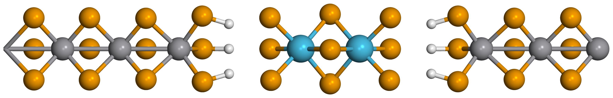
</td>
</tr>
<tr>
<td>

| 항목 | 값 |
|---|---|
| d (VSe3-Hf2Se9 terminal Se-Se 수직) | 3.73 Å (초기 3.5) |
| Se-H (own side) | 1.54 Å |
| Se-H (cross gap, mol Se ↔ gap H) | 2.29 Å |
| V-V (VSe3 chain, 최근접) | 3.14–3.23 Å |
| Hf-Hf | 3.23 Å |
| cell c | 32.50 Å |
| max force | 0.0090 eV/Å |
| final EKS | -114683.54 eV |

</td>
</tr>
</table>

### Perturbation range (v3 base, N = 14 우선)

상세 절차는 [`reports/perturbation-range2/perturbation-range2.md`](../../reports/perturbation-range2/perturbation-range2.md) 참고. 정의는 04-16과 동일 (A_mol vs B_nomol Hartree 포텐셜 ΔV macroscopic 평균, gauge offset 보정, exp decay fit). VSe3 주기는 새 base의 V-V 평균 `a = 3.18 Å` 사용.

<table>
<tr>
<td align="center">
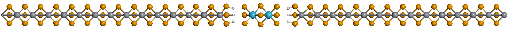 
A: VSe3 + Hf2Se9 분자 (N = 14, 132 atoms, cell c = 102.5 Å)
</td>
</tr>
<tr>
<td align="center">
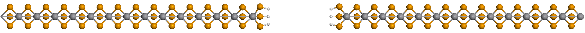 
B: VSe3-only (N = 14, 121 atoms, 분자 Hf2Se9 11개 제거)
</td>
</tr>
<tr>
<td align="center">
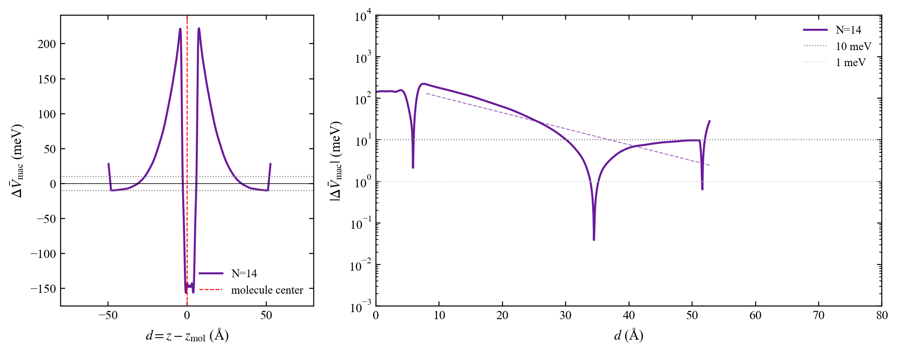 
좌: 선형 ΔVmac(d). 우: log |ΔVmac|, positive d side + 지수감쇄 fit (점선).
</td>
</tr>
</table>

| N | cell c (Å) | peak \|ΔV\| (meV) | d10meV (Å) | d1meV (Å) | tail (meV) | λ (Å) |
|---|---|---|---|---|---|---|
| 14 | 102.5 | 221 | 5.79 | 33.9 | 28.0 | 11.3 |

**관찰**

- v3 분자 좌표(정정) base에서 peak \|ΔV\| = 221 meV (04-16 v1의 N = 14 결과 389 meV 대비 절반).
- N = 14 단독 d10meV = 5.79 Å (v1의 4.57 Å보다 약간 멀리).
- 셀 끝 tail 28 meV (v1 N = 14의 13.1 meV보다 큼) — perturbation 더 멀리 감.
- λ ≈ 11.3 Å, v1 N = 14 (10.7 Å)와 거의 동일.
- N = 20, 24 (A_mol)는 SCF.DM.Tolerance = 1.0d-8에서 dDmax가 7자리 0까지 떨어졌으나 SIESTA가 SCF 종료 판정을 안 하고 진동 (Pulay history singular edge case). **Tolerance를 1.0d-7로 완화하니 NORMAL_EXIT로 빠르게 수렴** (N20_A_mol 6 iter, N24_A_mol 9 iter, DM 재사용). 7자리 정밀도 결과는 1e-8 환경과 동일.

→ 다음 단계: N = 20, 24 결과 plot 갱신 → long-range 패턴 + transport 셀 길이 결정 (N24_B_nomol 진행 중).

---

## 논의할 사항

(미팅 직전에 작성)

---

## Meeting Notes

### Discussion

### Action Items

- [ ]
