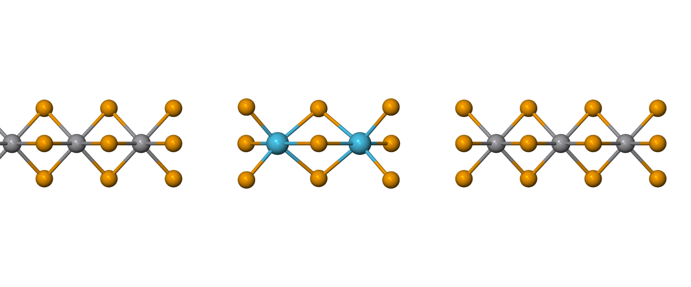
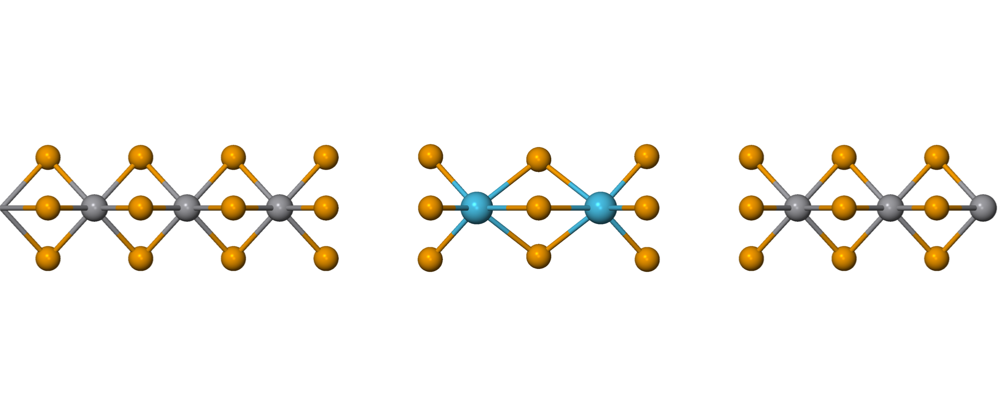
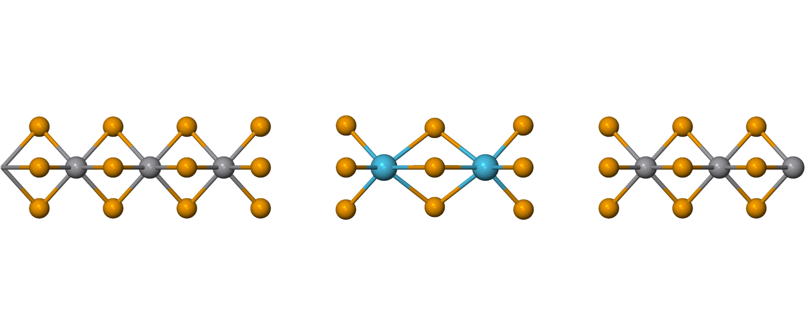
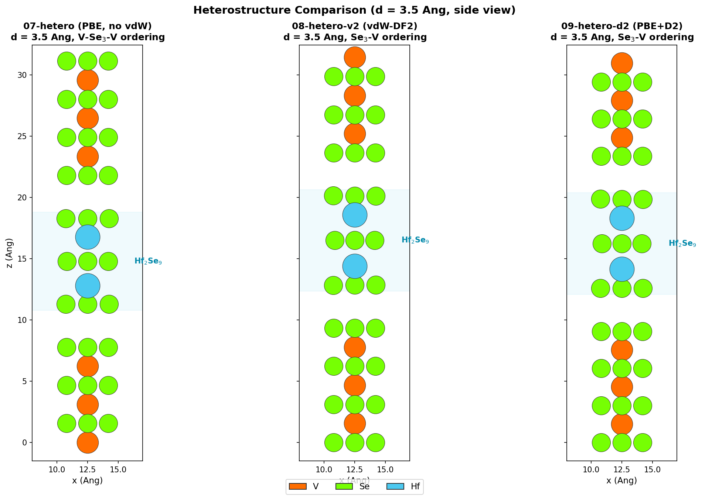
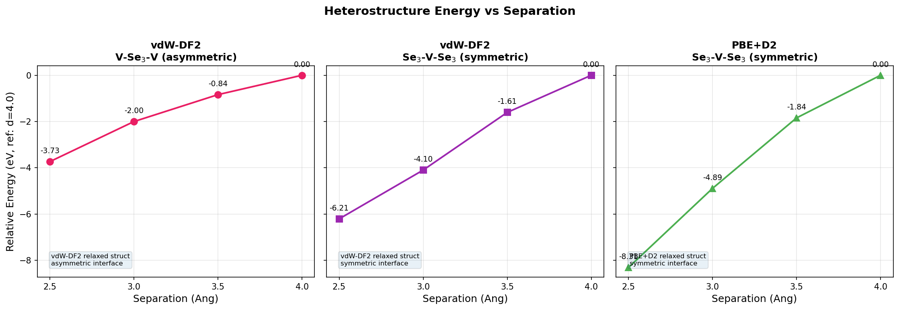

# Hf2Se9 Relaxation 실패 원인 분석

archive 데이터 기반 조사. Hf2Se9 chain 단독 6회 + 이종접합 계산 분석.

## 1. Hf2Se9 chain 단독 relaxation — 6회 시도 결과

### 001_rlx (중성, EnergyShift=10meV, Grimme D2)
- 초기: c = 20.693 Å, Hf-Hf(분자내) = 3.845 Å, 분자간 gap = 6.501 Å
- 최종: c = 23.967 Å (**16% 팽창**), Hf-Hf = 4.84 Å
- c축이 팽창하면서 Hf-Hf 분자내 결합이 ~1 Å 늘어남

### 002_rlx_totcharge-2 (TotalCharge = -2)
- 전하 -2로 Hf2Se9 ionic character 보정 시도
- 최종: Hf-Hf = 4.72 Å, 여전히 팽창

### 003_rlx_originstruct (1-unit-cell, 11 atoms)
- 벌크에서 추출한 단일 unit cell 구조 사용
- 최종: c = 10.803 → 8.450 Å (**22% 수축**, 반대 방향으로 붕괴)
- Hf-Hf = 3.657 → 3.378 Å

### 005_rlx_basis50 (EnergyShift=50meV)
- 더 작은 basis set으로 시도
- 최종: c ≈ 불변, Hf-Hf = 4.13 Å (약간 증가)
- 비교적 안정적이나 수렴 여부 불명확

### 006_rlx_basis50_tot-2 (50meV + TotalCharge=-2)
- **가장 심각한 실패**: c = 31.690 Å (53% 팽창)
- 분자간 gap 11.63 Å → chain이 분리되어 개별 molecule로 분해

## 2. 이종접합 (heterojunction) 계산

### separation test (003_heterojunction/001_separation_test)
- VSe3 3uc + Hf2Se9 + VSe3 3uc, VSe3-Hf2Se9 간 거리 1.0~5.0 Å 변화
- Single-point 에너지만 (MD.Steps = 0)
- Grimme D2 사용 (V, Se, Hf 모든 pair 파라미터 포함)

### 3uc 이종접합 relaxation (002_3uc, 38 atoms)
- 1 Broyden step에서 force 0.0099 eV/Å로 수렴 (기준 0.01)
- Hf-Hf = 3.797 → 3.814 Å (거의 불변)
- **주의**: VSe3가 양쪽에서 Hf2Se9를 물리적으로 구속 → "가짜 수렴"

### 20uc 이종접합 (003_20uc, 174 atoms)
- c = 133.4 Å, 2 Broyden step만 완료
- SCF 수렴 양호 (dDmax → 0, ~60 iterations)
- Relaxation 자체는 미완료 (계산량 과다)

### VASP MD (101_003_hetero/001_MD, 94 atoms)
- AIMD: Langevin 300K, 100 steps, 0.5 fs, DFT-D3 (IVDW=10)
- Hf-Hf = 3.82 Å 유지
- MD 결과를 SIESTA로 변환하여 band/PDOS 계산

## 3. Mulliken 전하 분석 (이종접합)

- Hf 원자: 전자를 받음 (Hf1: -0.27e, Hf2: -0.15e)
- 계면 V 원자: 벌크 V 대비 ~0.2e 더 많은 전자 보유
- 유의미한 charge transfer가 계면에서 발생

## 4. 근본 원인 분석

### 원인 1: Grimme D2의 Hf 파라미터 부정확
- D2에서 Hf의 C6 = 1089.41 eV·Å⁶, R0 = 3.574 Å — 매우 큰 값
- D2는 transition metal, 특히 5d 원소에 대해 알려진 한계가 있음
- VASP에서 DFT-D3(IVDW=10)를 사용하면 상대적으로 양호한 결과
- D3는 coordination number 의존 C6 값을 사용하므로 환경 적응적

### 원인 2: Basis set 민감도 (BSSE)
- EnergyShift 10meV (큰 basis) → 16% 팽창
- EnergyShift 50meV (작은 basis) → 거의 불변
- vdW gap 에너지 (~수십 meV)가 BSSE 오차 범위 내
- 큰 basis에서 overlap이 커지면서 인위적 반발이 발생하는 것으로 추정

### 원인 3: MD.VariableCell = T
- c축 relaxation 허용 시 vdW gap이 쉽게 붕괴하거나 팽창
- stress constraint로 `stress 1 2 4 5 6`을 고정하고 c축(3)만 자유
- 이 자유도가 불안정성의 직접적 원인
- PES가 flat하여 작은 force에도 큰 cell 변형

### 원인 4: 출발 구조 의존성
- 2-unit-cell 구조(001) → 팽창
- 1-unit-cell 벌크 추출 구조(003) → 수축
- 동일 시스템인데 초기 구조에 따라 완전히 반대 방향으로 수렴
- PES에 multiple local minima 또는 very flat saddle point 존재

### 원인 5: 이종접합 "가짜 수렴"
- 3uc 이종접합에서 1 step 수렴은 VSe3 cage 효과
- Hf2Se9가 물리적으로 구속되어 움직이지 못한 것
- 진짜 안정이 아니라 kinetic trapping

## 5. vdW 보정 방법 비교: D2 vs D3(BJ) vs vdW-DF2

이번 실패의 핵심 원인이 vdW 보정이므로, 대안적 방법들을 상세히 비교한다.

### C6 분산 계수란?

C6는 두 원자 사이 **van der Waals 인력의 세기**를 결정하는 계수이다.

모든 원자는 순간적으로 전자 분포가 비대칭해지면서 일시적 쌍극자(instantaneous dipole)가 생기고,
이것이 이웃 원자의 전자 구름을 유도하여 서로 끌어당기는 힘이 발생한다. 이것이 **London 분산력**(vdW 인력)이다.

이 인력의 크기는 원자의 **분극률(polarizability)**에 비례한다.
분극률이란 외부 전기장에 의해 전자 구름이 얼마나 쉽게 찌그러지는지를 나타내는 양이다.

- 전자가 많고 느슨하게 묶인 원자(Hf 같은 큰 원자) → 분극률 큼 → C6 큼 → 강한 vdW 인력
- 전자가 적거나 단단히 묶인 원자(O, F 등) → 분극률 작음 → C6 작음

수식으로는:

```
E_disp = -C6 / R^6
```

R은 원자 간 거리. C6가 클수록 같은 거리에서 더 강하게 끌어당긴다.

**문제의 핵심**: Hf **자유 원자**는 전자 구름이 느슨하여 C6가 매우 크다(1089 eV·Å⁶).
그러나 Hf2Se9 안에서 Hf는 6개의 Se에 둘러싸여 전자가 구속되므로 실제 C6는 훨씬 작아야 한다.
D2는 이 **환경 변화를 무시**하고 항상 자유 원자 C6를 쓰므로, vdW 힘을 잘못 계산한다.

### 5-1. Grimme D2 — 현재 사용 중, 실패 원인

D2 (Grimme 2006, J. Comput. Chem. 27, 1787)의 dispersion energy:

```
E_disp = -s6 Σ C6_ij / R_ij^6 · f_damp(R_ij)
```

**문제점:**

1. **고정 C6 값**: 원소마다 하나의 C6만 사용. 자유 원자 분극률에서 유도.
   - Hf 자유 원자: 분극률이 크고 C6 = 1089.41 eV·Å⁶
   - 그러나 Hf2Se9에서 Hf는 Se에 둘러싸여 분극률이 감소하므로 실제 C6는 훨씬 작아야 함
   - D2는 이 환경 변화를 반영하지 못함 → **vdW 상호작용을 과대/과소 평가**

2. **R0도 고정**: vdW 반지름이 원소별 하나로 고정. 결합 환경에 따른 원자 크기 변화 무시.

3. **damping function의 한계**: 단거리에서 E_disp → 0으로 급격히 꺾이는 zero-damping.
   중거리(equilibrium 부근)에서 에너지 기여가 불연속적일 수 있음.

4. **transition metal 한계**: D2 파라미터 테이블은 주로 main-group 원소로 검증됨.
   5d 원소(Hf, Ta, W 등)에 대한 정확도가 낮음.

### 5-2. Grimme D3(BJ) — 권장 대안

D3 (Grimme 2010, J. Chem. Phys. 132, 154104)의 핵심 개선:

```
E_disp = -Σ [s6·C6_ij(CN)/R_ij^6 + s8·C8_ij(CN)/R_ij^8] · f_damp(R_ij)
```

**D2 대비 개선점:**

1. **coordination number(CN) 의존 C6**:
   - 원자의 배위수(주변에 몇 개의 원자가 결합)에 따라 C6를 보간
   - 자유 Hf 원자(CN≈0): 큰 C6 → Hf in HfSe₃(CN≈6): 작은 C6
   - 사전 계산된 참조 데이터(TDDFT)에서 다양한 CN에 대한 C6를 tabulate
   - **환경 적응적**: 같은 Hf라도 molecule vs chain vs bulk에서 다른 C6

2. **C8 항 추가**: R⁻⁸ 항이 중거리 상호작용을 더 정확히 기술.

3. **BJ(Becke-Johnson) damping**:
   ```
   f_damp(R) = R^n / (R^n + (a1·R0_ij + a2)^n)
   ```
   - Zero-damping(D3-zero)과 달리, 단거리에서 유한 상수로 수렴
   - 중거리 영역에서 더 매끄러운 에너지 프로파일
   - Equilibrium 구조 근처에서 PES가 안정적 → **relaxation 수렴 개선**

4. **3-body term (ATM)**: 선택적으로 3체 Axilrod-Teller-Muto 항 포함 가능.

**Hf2Se9에 적용 시 기대 효과:**
- Hf의 C6가 배위 환경에 맞게 감소 → vdW gap 과팽창 방지
- BJ damping으로 PES가 smoother → Broyden optimizer가 올바른 minimum을 찾기 쉬움
- VASP에서 DFT-D3(IVDW=10)로 Hf-Hf = 3.82 Å가 유지된 것이 이를 뒷받침

**SIESTA에서의 사용:**
- SIESTA 4.1+ 에서 `libdftd3` 연동으로 D3 사용 가능
- 설정: `MM.DFT-D3` 관련 키워드 (버전별 차이 있음, 확인 필요)
- 또는 외부 `dftd3` 프로그램으로 후처리 보정

### 5-3. vdW-DF2 — 비경험적 대안

vdW-DF (Dion 2004, Phys. Rev. Lett. 92, 246401; Lee 2010 for vdW-DF2):

```
E_xc = E_x^GGA + E_c^LDA + E_c^nl
```

여기서 E_c^nl이 비국소(non-local) 상관 에너지로, vdW 상호작용을 포착.

**D2/D3와의 근본적 차이:**

1. **경험적 파라미터 없음**: C6, R0 같은 원소별 파라미터가 없다.
   전자 밀도에서 직접 vdW 에너지를 계산하므로 원소 의존성이 자동 포함.
   → **Hf처럼 D2 파라미터가 부정확한 원소에 특히 유리**

2. **전자 밀도 기반**: 상호작용이 국소 전자 밀도와 그 기울기에서 결정됨.
   화학적 환경 변화가 자동 반영. D3의 CN 보간보다 더 근본적인 접근.

3. **seamless 범위**: 단거리-중거리-장거리가 하나의 functional로 처리.
   damping function이 필요 없으므로 PES에 인위적 불연속이 없음.

**단점:**
- 계산 비용이 D2/D3보다 높음 (non-local kernel 적분)
- Exchange functional 선택에 민감 (vdW-DF2는 rPW86 exchange 사용)
- SIESTA에서 지원은 하지만 성능 최적화가 코드에 따라 다름

**SIESTA에서의 사용:**
```
XC.functional  VDW
XC.authors     DRSLL    # vdW-DF (original)
# 또는
XC.authors     LMKLL    # vdW-DF2 (improved)
# 또는
XC.authors     KBM      # vdW-DF-cx (consistent exchange)
```
- Grimme 관련 키워드 불필요 (grimme.fdf 제거)
- MeshCutoff를 충분히 높게 유지 (500 Ry 이상)

### 5-4. 방법 비교 요약

| 특성 | D2 | D3(BJ) | vdW-DF2 |
|------|-----|---------|---------|
| C6 결정 | 고정 (원소별 1개) | CN 의존 보간 | 전자 밀도에서 직접 |
| 환경 적응성 | 없음 | CN으로 근사 | 완전 자기 일관적 |
| Hf 파라미터 | 부정확 가능 | 참조 데이터에서 보간 | 파라미터 불필요 |
| damping | zero (불연속적) | BJ (매끄러움) | 불필요 (seamless) |
| 계산 비용 | 무시 가능 | 무시 가능 | GGA 대비 ~1.5× |
| SIESTA 지원 | O (내장) | 조건부 (libdftd3) | O (내장) |
| 신뢰도 (Hf2Se9) | 낮음 (실패 확인) | 높음 (VASP 검증) | 높음 (이론적) |

### 5-5. 권장 전략

1. **D3(BJ) 우선 시도**: VASP에서 이미 검증됨. SIESTA에서 libdftd3 연동 가능 여부 확인.
2. **vdW-DF2 대안**: D3 연동이 어려우면 vdW-DF2 사용. SIESTA 내장이므로 설정이 간단.
3. **비교 검증**: 동일 구조(Hf2Se9 molecule)에 대해 D2/D3/vdW-DF2로 single-point 계산하여 Hf-Hf 최적 거리 비교 → 실험값(3.62 Å)과 가장 가까운 방법 채택.

---

## 6. Heterostructure Separation Test — 3가지 버전 비교

VSe3(3uc)–Hf₂Se₉–VSe3(3uc) 이종접합에서 VSe3–Hf₂Se₉ 간 separation을 2.5~4.0 Å로 변화시켜 single-point 에너지를 계산했다. 3가지 버전은 **구조 자체가 다르므로** total energy를 직접 비교할 수 없고, 각 버전 내에서의 에너지 경향만 비교한다.

### 6-1. 버전 구분

| 버전 | Functional | 구조 원본 | 계면 배치 | V-Se 간격 (Å) | z lattice (Å) |
|------|-----------|----------|----------|--------------|--------------|
| 07-hetero | vdW-DF2 | vdW-DF2 relaxed VSe3 + Hf₂Se₉ | V-Se₃-V (비대칭) | 1.557 | 32.690 (d=3.5) |
| 08-hetero-v2 | vdW-DF2 | 07과 동일 구조, 뒤집어서 Se-Se 마주보게 | Se₃-V-Se₃ (대칭) | 1.557 | 32.980 (d=3.5) |
| 09-hetero-d2 | PBE+D2 | PBE+D2 relaxed VSe3 + Hf₂Se₉ | Se₃-V-Se₃ (대칭) | 1.513 | 32.453 (d=3.5) |

**주요 차이점:**
- **07 vs 08**: 같은 functional(vdW-DF2), 같은 구조 — 계면 배치만 다름 (V-facing vs Se-facing). total energy 직접 비교 가능.
- **07/08 vs 09**: functional(vdW-DF2 vs PBE+D2)과 relaxed 구조가 모두 다름. total energy 직접 비교 불가.
- **VSe3 내부 치수**: 09(PBE+D2 relaxed)는 V-Se 간격이 1.513 Å로 07/08(vdW-DF2 relaxed, 1.557 Å)보다 짧다.

### 6-2. 구조 렌더링 (d = 3.5 Å, side view)

#### 07-hetero (vdW-DF2, V-Se₃-V 비대칭)


vdW-DF2 relaxed VSe3 + Hf₂Se₉ 사용. V-Se₃-V 순서로 배열 (비대칭 계면).

#### 08-hetero-v2 (vdW-DF2, Se₃-V-Se₃ 대칭)


07과 동일 구조를 뒤집어 Se-Se가 마주보게 배치 (대칭 계면). Functional은 07과 동일(vdW-DF2).

#### 09-hetero-d2 (PBE+D2, Se₃-V-Se₃ 대칭)


PBE+D2 relaxed VSe3 + Hf₂Se₉ 사용. Se₃-V-Se₃ 대칭 배치. Functional과 구조 모두 07/08과 다르다.

#### 3개 구조 비교


### 6-3. 에너지 결과 (각 버전 내 상대 에너지, d=4.0 기준)



| d (Å) | 07 vdW-DF2 V-Se₃-V (eV) | 08 vdW-DF2 Se₃-V-Se₃ (eV) | 09 PBE+D2 Se₃-V-Se₃ (eV) |
|-------|--------------------------|----------------------------|-----------------------------|
| 2.5 | -3.73 | -6.21 | -8.31 |
| 3.0 | -2.00 | -4.10 | -4.89 |
| 3.5 | -0.84 | -1.61 | -1.84 |
| 4.0 | 0.00 | 0.00 | 0.00 |

### 6-4. 분석

1. **3가지 모두 d=2.5에서 에너지가 계속 감소 중** — 현재 범위(2.5~4.0 Å) 내에서 minimum을 찾지 못했다.
2. **07 vs 08 (같은 functional, 계면만 다름)**: Se-Se 대칭 배치(08)가 V-facing(07)보다 기울기가 급하다. d=4.0에서 total energy도 08이 0.60 eV 낮다. Se-Se 계면이 더 강하게 결합함을 의미한다.
3. **09(PBE+D2)는 07/08(vdW-DF2)과 직접 비교 불가**: functional과 relaxed 구조가 모두 다르므로 기울기 차이의 원인을 분리할 수 없다.

---

## 7. 향후 개선 방향 요약

| 문제 | 해결책 |
|------|--------|
| D2 부정확 | D3(BJ) 또는 vdW-DF2 사용 |
| BSSE | EnergyShift 수렴 테스트 (10, 30, 50, 100 meV) |
| Cell 불안정 | VariableCell=F로 먼저 원자만 relax → 이후 cell |
| 출발 구조 | archive relaxed 구조 사용 (이미 반영) |
| 이종접합 | 단계적 relax: VSe3 고정 → Hf2Se9만 → 전체 |
